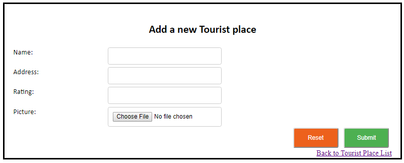
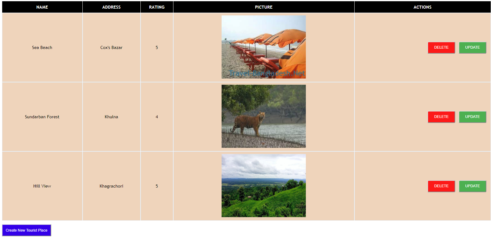

## Web Development Assignment 1 From Enosis

### Instructions:

ou are given two images for adding/editing new tour place and viewing tour places list div. The task is to create
a single dynamic HTML page where both the form and list will be placed. 
At first the places list div will be hidden. It will be visible and form div will be hidden when user clicks
on Submit or Back to Tourist Place List. User can again go back to add/edit form by clicking on 
Create New Tourist Place/Update button.

The following items need to be implemented after designing the grid -

1. Implement the functionalities to Create/Update/Delete places. Use a Javascript array to persist the places.
2. Implement sorting on rating column (ASC, DESC, None).
3. Implement a search-as-you-type searching (partial match) by tourist places' name(s).
4. Implement input field validations.

### Given Images:

